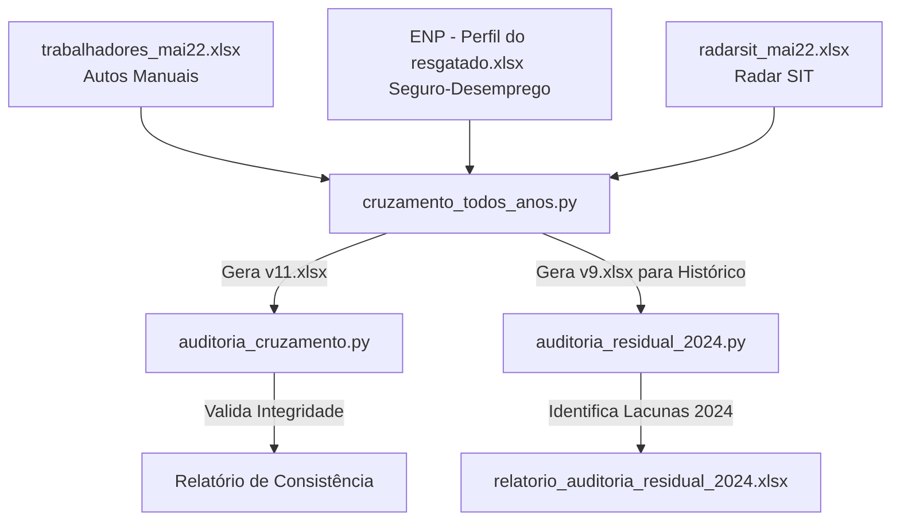

# Documentação Técnica: Sistema de Cruzamento e Auditoria de Dados (v11)

Esta documentação detalha o funcionamento, as regras de negócio, a lógica interna e as rotinas de validação do ecossistema de scripts desenvolvidos para o processamento de dados do projeto **"Escravo, nem pensar!"**.

O objetivo técnico principal do sistema é unificar e correlacionar dados de trabalhadores resgatados sob condições análogas à escravidão no Brasil a partir de três bases:
1. **Planilha de Autos Manuais:** Registros internos mantidos pela equipe.
2. **Perfil do Seguro-Desemprego:** Dados demográficos oficiais do requerimento do benefício de Seguro-Desemprego do Trabalhador Resgatado.
3. **Radar SIT:** Dados públicos consolidados de fiscalizações de trabalho escravo da Subsecretaria de Inspeção do Trabalho.

---

## 1. Arquitetura de Scripts do Ecossistema

O processamento é dividido em três scripts em Python localizados na raiz do repositório:

* **[cruzamento_todos_anos.py](file:///E:/code/enp/cruzamento_todos_anos.py):** Script de ETL primário que executa limpeza, padronização, cruzamentos e formatação das cores das colunas no Excel.
* **[auditoria_cruzamento.py](file:///E:/code/enp/auditoria_cruzamento.py):** Validador pós-processamento que executa testes lógicos para identificar falhas estruturais, produtos cartesianos e divergências temporais.
* **[auditoria_residual_2024.py](file:///E:/code/enp/auditoria_residual_2024.py):** Script de auditoria focada no ano de 2024 para diagnosticar os motivos de falha de cruzamento com o Radar SIT (divergências de CNPJ e grafias).

---

## 2. Detalhamento Técnico das Regras de Negócio

### Pré-processamento e Higienização de Dados
* **Limpeza de Documentos (CPFs e CNPJs):** Caracteres não numéricos (como `.`, `-`, `/`) são excluídos. O sistema realiza o preenchimento de zeros à esquerda (*padding*), garantindo comprimento de 11 dígitos para CPFs e 14 dígitos para CNPJs para mitigar perdas de formatação na importação das planilhas.
* **Normalização Textual:** Strings associadas a nomes de trabalhadores, estabelecimentos e proprietários são convertidas para maiúsculas, com codificação ASCII (remoção de acentos via normalização Unicode `NFKD`) e eliminação de espaços duplicados.
* **Bloqueio do "Falso Zero":** A função `remove_leading_zeros` remove zeros à esquerda de identificadores de operação numérica para evitar que valores nulos sejam erroneamente pareados com o valor "0" do Radar SIT (que designa registros genéricos).

---

### Etapa 1: Vínculo Trabalhador × Perfil do Seguro-Desemprego
Esta etapa realiza o cruzamento para associar o trabalhador autuado manualmente ao seu respectivo cadastro demográfico oficial do Seguro-Desemprego.

* **Junção Hierárquica:**
  1. Tenta correspondência exata do nome do trabalhador.
  2. Para os registros remanescentes, aplica correspondência nebulosa (*fuzzy match*) usando a distância Levenshtein (`fuzzywuzzy`), exigindo similaridade mínima de 90% (cutoff de 90).
* **Desempate de Homônimos:** Se o mesmo nome possuir múltiplos registros na base de Seguro-Desemprego, o sistema calcula a diferença absoluta de dias entre a "Data de Resgate" e a "Data de Afastamento/Demissão" declarada nos autos. Apenas a linha de menor intervalo temporal é mantida.
* **Validação Antihomônimos:** Uma rotina analisa os sobrenomes comparando as strings dos nomes (desconsiderando preposições padrão). Se não houver ao menos uma palavra em comum entre os sobrenomes das bases, a correspondência é rejeitada.
* **Trava Temporal:** Divergências temporais superiores a 365 dias são marcadas na coluna `flag_data_divergente` como `True`. Os registros que falharem na validação de sobrenomes ou ultrapassarem a barreira temporal são excluídos do cruzamento final.

---

### Etapa 2: Vínculo Operação × Radar SIT
Consiste na vinculação do trabalhador à operação de fiscalização oficial correspondente no Radar SIT.

* **Conversão de Vazios:** Valores em branco ou strings representativas de nulos (como "NaN", "nan") são convertidos em nulos reais (`np.nan`). O merge é executado com remoção de nulos (`.dropna()`) para evitar correspondência cruzada de campos em branco (*Empty String Match*).
* **Restrição de Ano Fiscal:** A junção obrigatoriamente exige que a variável `ano relatorio` seja idêntica ao `Ano` do Radar SIT.
* **Níveis de Prioridade:**
  * **Prioridade 3 (Máxima):** Correspondência por documento identificador (CNPJ ou CPF do empregador).
  * **Prioridade 2:** Correspondência exata pelo nome do estabelecimento inspecionado limpo.
  * **Prioridade 1 (Mínima):** Correspondência cruzada de Razão Social/Nome Fantasia (Base Manual) contra Proprietário/Estabelecimento (Radar SIT).
* **Deduplicação de Saída:** O DataFrame resultante é ordenado de forma decrescente pela prioridade de correspondência e pela igualdade do número de operação. Duplicatas baseadas na chave `['Nome Requerente_Limpo', 'ano relatorio', 'operacao']` são descartadas, restando apenas o melhor vínculo disponível. Os trabalhadores sem par no Radar SIT são mantidos na base via junção externa parcial, com a flag de estabelecimento marcada como `SEM_CORRESPONDENCIA_SIT`.

---

## 3. Métricas de Qualidade e Classificação

### Status de Validação (`flag_estabelecimento`)
Após as etapas de cruzamento, a confiabilidade do vínculo de estabelecimento é classificada nas seguintes categorias:

| Status | Descrição Técnica |
| :--- | :--- |
| `VALIDADO_POR_CNPJ` | Confirmação por igualdade estrita dos CNPJs/CPFs do empregador. |
| `AUSENTE` | Falha na correspondência de documento e ausência de nomes de estabelecimentos cadastrados para validação textual. |
| `COMPATIVEL` | Sobreposição de termos textuais (*overlap* de palavras) dos estabelecimentos igual ou superior a 35%. |
| `DIVERGENTE` | Sobreposição textual dos estabelecimentos inferior a 35% (pode indicar conflitos entre matrizes e filiais). |
| `SEM_CORRESPONDENCIA_SIT` | Nenhuma correspondência localizada na base oficial do Radar SIT para o ano correspondente. |

### Checagem de Prazos (`checagem`)
Avaliada a partir da coluna `diferenca_dias_resgate`:
* **Até 90 dias:** Sem pendência (célula vazia).
* **De 91 a 365 dias:** Marcado como `verificar`.
* **Superior a 365 dias:** Marcado como `divergente (>365d)`.

---

## 4. Rotinas de Auditoria

### Auditoria Geral (`auditoria_cruzamento.py`)
Este utilitário é executado sobre a base consolidada final gerada pelo script de cruzamento para fins de garantia de qualidade:
1. **Produto Cartesiano:** Valida se a chave única `['nome_trabalhador_limpo', 'ano relatorio', 'operacao']` foi duplicada no processo.
2. **Homônimos/Reincidentes:** Informa a relação de volume total de linhas vs trabalhadores únicos.
3. **Anomalia de Operação "0":** Sinaliza se registros indevidos cruzaram com a operação corrompida padrão "0" do Radar SIT.
4. **Validação Temporal:** Checa se registros que violaram a barreira dos 365 dias passaram sem marcação.
5. **Integridade de Ano Fiscal:** Garante que o ano do relatório dos autos manuais corresponde estritamente ao ano oficial do Radar SIT.
6. **Mapeamento de Status:** Consolida a frequência de cada categoria de `flag_estabelecimento`.

### Auditoria Residual (`auditoria_residual_2024.py`)
Utilitário focado no diagnóstico de registros classificados como `SEM_CORRESPONDENCIA_SIT` para o ano fiscal de 2024:
* Cruza o resíduo diretamente com a planilha oficial baseada em `Ano` e `Operação`.
* Classifica as ocorrências com a flag `DIAGNOSTICO_CNPJ` nas categorias:
  * `OPERAÇÃO NÃO ENCONTRADA NO RADAR SIT`
  * `TRABALHADOR SEM CNPJ NO SEGURO-DESEMPREGO`
  * `IGUAIS (Anomalia de nome/vazio na V9)` (indicando que a correspondência de nomes falhou na v9, embora os documentos fossem iguais)
  * `DIVERGENTE (Erro de digitação/Matriz x Filial)`

---

## 5. Formatação Visual das Colunas

Para facilitar a auditoria visual humana, o relatório Excel gerado pelo cruzamento é colorido utilizando tons pastéis (aplicados via biblioteca `openpyxl`):

* **Amarelo (`#FFF2CC`):** Atributos nativos dos Autos Manuais.
* **Verde (`#E2EFDA`):** Atributos do perfil demográfico (Seguro-Desemprego).
* **Azul (`#DDEBF7`):** Atributos de fiscalização oficial (Radar SIT).